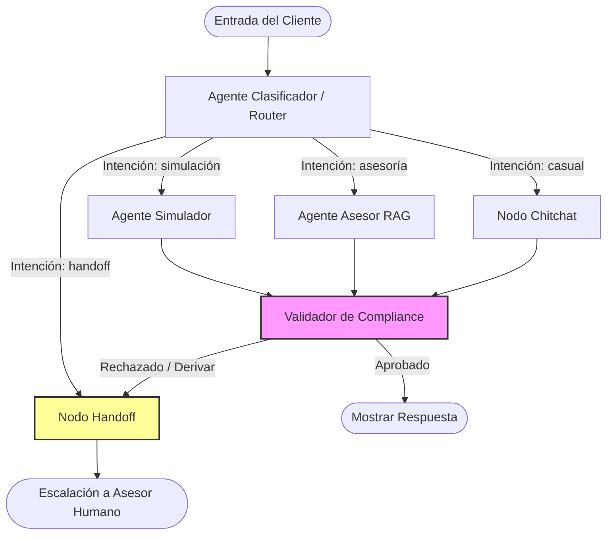

# banking-multiagent-langgraph

[](https://github.com/DazzleEaglePe/banking-multiagent-langgraph)
[](LICENSE)
[](https://www.python.org/)
[](https://github.com/langchain-ai/langgraph)
[](https://github.com/run-llama/llama_index)
[](https://github.com/chroma-core/chroma)

Un sistema conversacional multi-agente de nivel de producción desarrollado con **LangGraph** y **Google Gemini** para la simulación automatizada de créditos de consumo, asesoría en políticas de admisión y auditoría de cumplimiento regulatorio (SBS/PII) en tiempo real.

Este proyecto implementa una arquitectura orientada a agentes y adaptada a las reglas de negocio de la microfinanciera **Caja Ica (CMAC Ica)**. El sistema coordina especialistas independientes para atender consultas, ejecutar simulaciones con matemática financiera exacta y aplicar validaciones normativas automáticas antes de mostrar respuestas al usuario.

---

## Características Clave

- **Orquestación Multi-Agente Asíncrona:** Flujo de control basado en un `StateGraph` de LangGraph que mantiene el historial conversacional persistente mediante un checkpointer en memoria (`MemorySaver`).
- **Simulador Financiero Incorporado:** Calcula cronogramas bajo el sistema de amortización francés, realiza conversiones automáticas de TEA a TEM e inyecta la prima mensual fija del seguro de desgravamen de Caja Ica.
- **Oficial de Cumplimiento Regulatorio (Compliance Officer):** Agente de auditoría preventivo (LLM-as-a-Judge) que analiza en tiempo real la salida de los especialistas para bloquear fugas de PII/OTP o solicitudes confidenciales según la Ley de Secreto Bancario (Ley N° 26702).
- **Recuperación Semántica RAG:** Conector RAG a LlamaIndex alimentado por un índice persistente en ChromaDB con el reglamento de créditos de Caja Ica.
- **Protocolo de Derivación (Handoff) Automático:** Derivación estructurada a asesores humanos cuando el usuario solicita transacciones prohibidas en canales interactivos o expresa conductas inadecuadas.

---

## Arquitectura del Grafo

La toma de decisiones y las respuestas se procesan secuencialmente a través del siguiente grafo de estados:



### Roles y Nodos:
- **Router (`agents/router.py`):** Analiza el mensaje y extrae los parámetros de simulación (`monto`, `cuotas`, `tipo_credito`) en una sola llamada estructurada.
- **Asesor RAG (`agents/advisor.py`):** Recupera las políticas de Caja Ica para resolver dudas de admisión y calificación crediticia (ej: Infocorp CPP/Dudoso).
- **Simulador (`agents/simulator.py`):** Obtiene interactivamente los parámetros faltantes y presenta la cotización comercial calculada.
- **Compliance Officer (`agents/compliance.py`):** Validador preventivo que actúa como cortafuegos regulatorio ante solicitudes de saldos o transacciones críticas.
- **Handoff (`agents/handoff.py`):** Redacta el mensaje formal de derivación guiando al usuario a la central telefónica o canales de atención humana oficiales.

---

## Matemática Financiera (Amortización Francesa)

La herramienta de simulación (`tools.py`) aplica las fórmulas oficiales del sistema de créditos de Caja Ica:

1. **Conversión de TEA a TEM (Tasa Efectiva Mensual):**
   $$TEM = (1 + TEA)^{\frac{1}{12}} - 1$$
   *   *CrediAhorro (Garantía Líquida):* TEA = 18.5%
   *   *Facilito (Sin Vivienda/Aval):* TEA = 35.0%
   *   *Personal Directo:* TEA = 48.0%

2. **Cálculo de la Cuota Base Mensual:**
   $$Cuota_{base} = Principal \times \frac{TEM \cdot (1 + TEM)^n}{(1 + TEM)^n - 1}$$
   *Donde $n$ representa la cantidad de cuotas mensuales.*

3. **Cálculo del Seguro de Desgravamen Fijo:**
   Se aplica una tasa mensual fija del **0.085%** sobre el capital prestado:
   $$Cuota_{total} = Cuota_{base} + (Principal \times 0.00085)$$

---

## Estructura de Archivos

```
banking-multiagent-langgraph/
├── data/                             # Políticas y documentos fuente del banco
├── requirements.txt                  # Dependencias del proyecto con versiones fijas
├── config.py                         # Conexión al SDK de Gemini y parches de red (REST)
├── state.py                          # Esquema de estado conversacional del grafo
├── tools.py                          # Herramientas de cálculo financiero e indexador ChromaDB
├── graph_builder.py                  # Ensamblador del StateGraph de LangGraph con memoria
├── main.py                           # Cliente conversacional interactivo por consola
├── test_cases.py                     # Suite automática con los 4 casos límite de prueba
└── README.md                         # Documentación del proyecto
```

---

## Instalación y Ejecución

### 1. Preparar el Entorno
Clona este repositorio, crea tu entorno virtual e instala los paquetes requeridos:
```bash
python3 -m venv venv
source venv/bin/activate
pip install -r requirements.txt
```

### 2. Configurar la API Key
Crea un archivo `.env` en la raíz del proyecto:
```env
GEMINI_API_KEY=tu_clave_api_de_google_aquí
```

### 3. Ejecutar Conversación Interactiva
Ejecuta la interfaz conversacional para interactuar con la red de agentes y observar qué nodos se ejecutan en tiempo real:
```bash
python3 main.py
```

### 4. Ejecutar Suite de Pruebas
Corre las validaciones programáticas preconfiguradas para verificar de extremo a extremo los recorridos de cliente:
```bash
python3 test_cases.py
```
*(Nota: El sistema maneja de forma autónoma los rate-limits y reintentos automáticos para operar bajo las cuotas gratuitas de Google AI Studio).*
